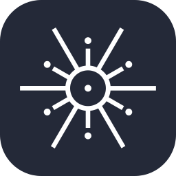
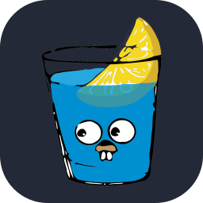

<!-- ======================== HEADER ======================== -->

  

  
  
  

<!-- ========================= ABOUT ========================= -->
## About

I'm a final year <b>Computer Science</b> student at <b>ITB (Bandung Institute of Technology)</b> working as a Software Engineer with <b>full-stack internship experience</b> building software for <b>financial institutions</b>. I gravitate toward <b>challenging problems</b> that demand <b>deep engineering knowledge</b>. I like weighing <b>engineering tradeoffs</b>, <b>optimizing production systems</b>, and learning the tech behind them along the way.

<!-- ====================== EXPERIENCE ====================== -->
## Experience

<table align="center">
  <tr>
    <th>💻</th>
    <th>Role</th>
    <th>Company</th>
    <th>Duration</th>
  </tr>
  <tr>
    <td></td>
    <td>Backend Engineer Intern</td>
    <td><a href="https://sekuritas.miraeasset.co.id/who-we-are" target="_blank">Mirae Asset Sekuritas</a></td>
    <td>Starting Oct 2026</td>
  </tr>
  <tr>
    <td>🟢</td>
    <td>Software Engineer Intern</td>
    <td><a href="https://www.bfi.co.id" target="_blank">BFI Finance</a></td>
    <td>Jul 2026 – Present</td>
  </tr>
</table>

 

> Open for <b><u>internship opportunities</u></b> in <b><u>Q1-Q2 2027</u></b>, and <b><u>full-time opportunities</u></b> from <b><u>July 2027</u></b> onward. Feel free to <a href="https://brianricardo.dev/#contact" target="_blank">reach out</a> on any platform, I'll get back to you whenever I can.

---

<!-- ====================== TECH STACK ====================== -->
## Tech Stack

**Languages**

&nbsp;&nbsp;&nbsp;&nbsp;&nbsp;&nbsp;&nbsp;&nbsp;&nbsp;&nbsp;

**Frontend**

&nbsp;&nbsp;

**Backend**

&nbsp;&nbsp;&nbsp;&nbsp;&nbsp;&nbsp;&nbsp;&nbsp;

**Data & Infra**

&nbsp;&nbsp;&nbsp;&nbsp;&nbsp;&nbsp;&nbsp;&nbsp;&nbsp;&nbsp;

---

<!-- ======================== CONNECT ======================== -->
## Connect

  
  
  
  

---

<!-- ======================== FOOTER ======================== -->

   

